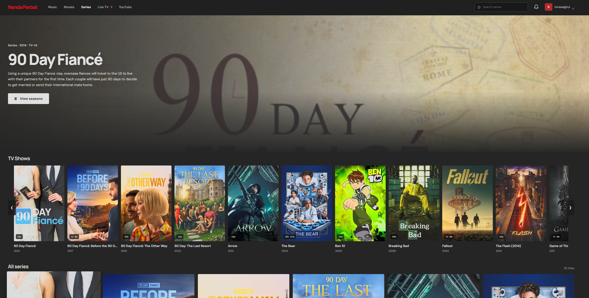
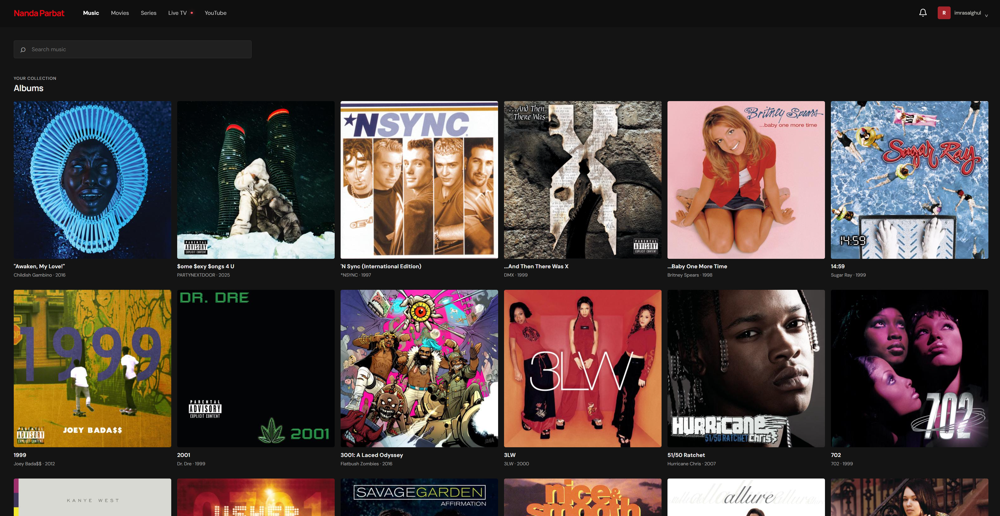
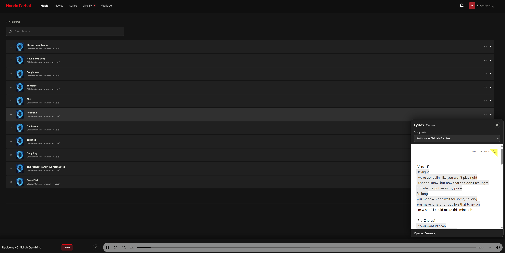
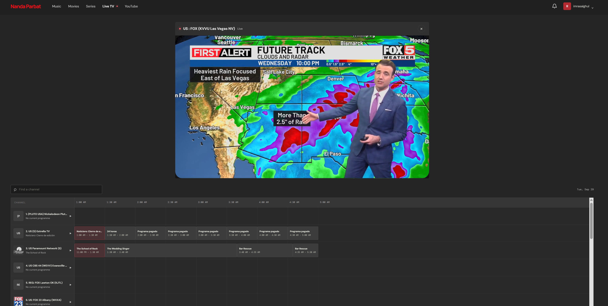
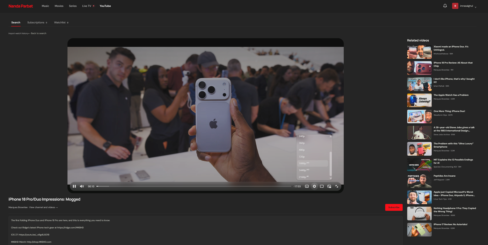

# home-cinema

A self-hosted web interface for the media services you run. Browse and play movies and series from Plex, music from Navidrome, YouTube through Invidious, and live channels from TVHeadend. Plex handles sign-in and library metadata; the app streams local Plex media from mounted folders.

> **Status:** Personal-server software. You must configure and operate the upstream services yourself. This project does not include media, a hosted service, or third-party API credentials.

## Features

- Plex sign-in and library browsing, with movie and series details, progress, and subtitles.
- Navidrome music library, playback, and Genius lyrics lookup.
- YouTube search, video playback, comments and replies, related videos, channels, subscriptions, watchlist, and watched indicators through Invidious.
- Live TV channels and electronic programme guide from TVHeadend.
- Optional Seerr integration for movie and series search and requests.
- Docker deployment with read-only media mounts.

## Screenshots

### Series



### Music





### Live TV



### YouTube



## Services

| Service | Use | Configuration |
| --- | --- | --- |
| Plex Media Server | Required: sign-in, library metadata, user identity | `PLEX_SERVER_URL`, `PLEX_MACHINE_ID` |
| Navidrome | Required for Music | `NAVIDROME_URL`, `NAVIDROME_USERNAME`, `NAVIDROME_PASSWORD` |
| Invidious | Required for YouTube features | `INVIDIOUS_URL` |
| TVHeadend | Required for Live TV | `TVHEADEND_URL`, `TVHEADEND_USERNAME`, `TVHEADEND_PASSWORD` |
| Genius API | Optional: music lyrics | `GENIUS_ACCESS_TOKEN` |
| Seerr | Optional: requests | `SEERR_URL`, `SEERR_API_KEY` |

The application reads the configured Invidious API for YouTube search, metadata, comments, channels, and media stream information. Use an Invidious instance you trust and configure it according to that instance's documentation.

## Direct links and Redirector

Open these paths on your Home Cinema host to jump directly to a section:

| Path | Opens |
| --- | --- |
| `/movies` | Movies |
| `/series` | Series |
| `/tv` | Live TV |
| `/music` | Music |
| `/youtube` | YouTube |
| `/youtube/watch?v=VIDEOID` | The YouTube video with that ID |
| `/youtube/@CREATORUSERNAME` | The creator page for that handle |

You can use [Redirector for Firefox](https://addons.mozilla.org/en-US/firefox/addon/redirector/) or [Redirector for Chromium](https://chrome.google.com/webstore/detail/redirector/ocgpenflpmgnfapjedencafcfakcekcd) to send YouTube links to this app. In Redirector, create a rule for each mapping below. Choose **Wildcard** for the rule's processing type and **Main window (address bar)** as where it applies. Replace `home-cinema.example.com` with the hostname where you run this app.

| Redirect from | Redirect to |
| --- | --- |
| `https://*youtube.com/watch?*v=*` | `https://home-cinema.example.com/youtube/watch?$2v=$3` |
| `https://youtube.com/@*` | `https://home-cinema.example.com/youtube/@$1` |
| `https://www.youtube.com/@*` | `https://home-cinema.example.com/youtube/@$1` |
| `https://www.youtube.com/channel/*` | `https://home-cinema.example.com/youtube/channel/$1` |

The watch rule keeps the video ID and any other query parameters, such as a playlist or start time. The channel rules support YouTube's `@handle` and channel-ID URL formats. Redirector is optional; the Home Cinema paths also work when opened directly.

## Run the published Docker image

The Compose configuration uses `ghcr.io/imrasalghul/home-cinema:latest`. On a host with Docker Engine and the Compose plugin:

1. Clone this repository and enter its directory.
2. Copy `.env.example` to `.env` and replace the dummy values with your own service addresses and credentials. Set `SITE_NAME` and choose a unique, randomly generated `SESSION_SECRET`.
3. Make sure the Docker host can reach Plex, Navidrome, Invidious, and TVHeadend. Adjust the media mounts in `docker-compose.yml` to match the paths Plex reports.
4. Pull and start the published image:

   ```sh
   docker compose pull home-cinema
   docker compose up -d --no-build home-cinema
   ```

5. Open the address and port published by Compose, then sign in with Plex.

The Compose defaults mount `/media/library/movies` and `/media/library/tv` read-only and publish port `3210`. Change the host-side mount paths in `docker-compose.yml` for your server. Set `APP_PUBLIC_URL` to the browser-facing HTTPS URL when Plex sign-in must return to a public hostname. A reverse proxy or tunnel should forward to the Compose-published port.

## Use Cloudflare Tunnel

Cloudflare Tunnel can publish Home Cinema on a hostname you control without opening an inbound router port. You need a domain configured in Cloudflare and a running Home Cinema container. See Cloudflare's [Tunnel quick start](https://developers.cloudflare.com/tunnel/get-started/) for dashboard details.

1. In the Cloudflare dashboard, open **Networking → Tunnels** and create a remotely managed tunnel, or select an existing tunnel. Choose **Cloudflared** as the connector and run the provided connector command on the Docker host or another machine that can reach it. Keep the tunnel token private.
2. Open the tunnel's **Routes** section and add a **Published application** route. Enter the public hostname you want to use, for example `media.example.com`, and set the service URL to `http://<docker-host-lan-ip>:3210`. If `cloudflared` runs directly on the Docker host, you can use `http://127.0.0.1:3210`. When it runs in a separate container, use an address reachable from that container; its own `localhost` points to the `cloudflared` container.
3. Set `APP_PUBLIC_URL` in `.env` to the exact HTTPS hostname, for example:

   ```dotenv
   APP_PUBLIC_URL=https://media.example.com
   ```

4. Apply the setting and start the app:

   ```sh
   docker compose up -d --no-build home-cinema
   ```

5. Open the HTTPS hostname and sign in with Plex. The Cloudflare route forwards requests to the app's port `3210`; the browser-facing connection uses HTTPS while the tunnel can connect to the app over HTTP on your private network.

No inbound port forwarding is needed; `cloudflared` creates outbound connections to Cloudflare. Leave Cloudflare caching at its defaults and do not add a **Cache Everything** rule for the app, since authenticated media and API routes are private. See Cloudflare's [published application routing guide](https://developers.cloudflare.com/tunnel/concepts/routing/) and [Tunnel overview](https://developers.cloudflare.com/tunnel/) for more information.

## TV remote navigation and phone sign-in

TV browsers enable remote navigation automatically when recognized. Use the D-pad to move between controls, OK/Select to activate them, and Back to close a menu or dialog or return to the previous view. Playback controls stay visible in TV mode. Standard gamepad D-pad and A/B buttons also work where the browser exposes them.

If a TV browser is not recognized, open the app with `?tv=1` (for example, `/movies?tv=1`). The choice is saved on that device. Use `?tv=0` to disable it. Desktop and mobile browsing keep their existing behavior unless TV mode is explicitly enabled. Compatibility depends on the TV browser and its media support; this is a web application, not a native TV app.

On the login page, choose **Sign in with phone**, scan the QR code, and approve the Plex sign-in on your phone. Keep the TV page open; it signs in automatically after approval. **Continue with Plex** remains available for signing in directly in the browser.

## Android TV app

The native Android TV app opens a Home Cinema server in Android System WebView. Android 10 (API 29) or newer is required. See [available apps](apps/README.md) and the [Android TV build and setup guide](apps/androidtv/README.md) for details.

## Build from source

To build the image locally instead of pulling it from GHCR, run `docker compose up -d --build home-cinema`.

## Local development

Requires Node.js 22 or later and pnpm. Plex media files must be accessible at the paths configured by Plex, either directly or through `PLEX_PATH_MAPPINGS`.

```sh
cp .env.example .env
pnpm install
pnpm dev
```

Open `http://localhost:5173`. The Vite development server proxies API requests to the local app server. Keep the development `.env` private; use only dummy credentials in examples and documentation.

## Configuration

All configuration is read by the server from `.env` or the process environment. `.env.example` contains dummy values only; replace them locally and never commit your `.env`.

| Variable | Purpose |
| --- | --- |
| `SITE_NAME` | Display name in the page title, header, Plex client identity, and Navidrome client field. |
| `SESSION_SECRET` | Secret used to sign session cookies and media URLs. Use a unique random value of at least 32 characters. |
| `PLEX_SERVER_URL` | Base URL of the Plex Media Server. |
| `PLEX_MACHINE_ID` | Plex server machine identifier used to verify the configured server. |
| `PLEX_CLIENT_IDENTIFIER` | Optional stable identifier for this app in Plex. |
| `PLEX_PATH_MAPPINGS` | Optional JSON object mapping Plex file path prefixes to paths inside the container. |
| `MEDIA_ROOT` | Media root inside the container; defaults to `/media/library`. |
| `NAVIDROME_URL` | Navidrome base URL reachable from the app server. |
| `NAVIDROME_USERNAME` / `NAVIDROME_PASSWORD` | Navidrome account used for music API and streams. |
| `INVIDIOUS_URL` | Base URL of the Invidious instance. |
| `GENIUS_ACCESS_TOKEN` | Optional Genius API access token used for lyric search. Keep it server-side. |
| `TVHEADEND_URL` | TVHeadend base URL reachable from the app server. |
| `TVHEADEND_USERNAME` / `TVHEADEND_PASSWORD` | TVHeadend credentials. |
| `SEERR_URL` / `SEERR_API_KEY` | Optional Seerr server and API key. |
| `APP_PUBLIC_URL` | Public browser-facing app URL used for Plex authentication return navigation. |
| `APP_PORT` | Host port exposed by Docker Compose; defaults to `3210`. |

`PLEX_PATH_MAPPINGS` is useful when Plex reports paths such as `/mnt/media/movies` while the app sees `/media/library/movies`. Example:

```dotenv
PLEX_PATH_MAPPINGS={"/mnt/media/movies":"/media/library/movies","/mnt/media/tv":"/media/library/tv"}
```

## Security and privacy

- Run the app behind HTTPS when accessing it outside your trusted LAN.
- Keep `.env`, Plex tokens, service passwords, API keys, session data, and user profiles private. Do not put credentials in frontend code, issue reports, screenshots, or committed files.
- Use a unique `SESSION_SECRET`; changing it signs out existing sessions and invalidates signed Plex media URLs.
- The app requires a Plex session for its normal media routes and sends media responses as `private, no-store`. Live TV is not edge-cached.
- Casting uses short-lived bearer URLs so a receiver can access a stream without the browser's Plex cookie. Anyone who obtains an active cast URL can use it until the grant expires or the owner signs out; do not share those URLs.
- Mount media read-only and restrict network access to the app and upstream services.

## Contributing

Bug reports and pull requests are welcome. Before sharing a reproduction, remove private server addresses, account names, media paths, cookies, session identifiers, and credentials from logs and screenshots. Add automated checks for changes where practical.

## License

This project is licensed under the MIT License. See [LICENSE](LICENSE).
